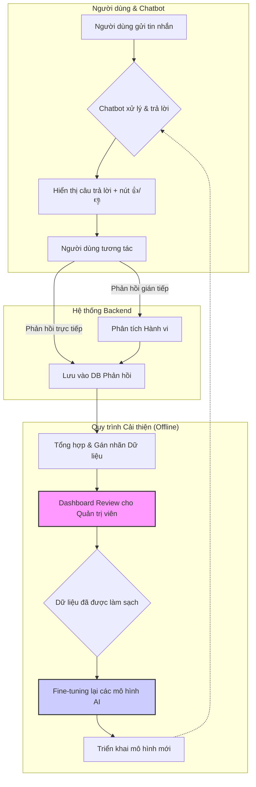

# Kiến trúc (ngắn gọn và đủ ý)

Mục tiêu: mô tả súc tích các thành phần chính, luồng dữ liệu và các quyết định triển khai.

## Thành phần chính
- **Backend**: FastAPI (async) — tách biệt, chịu trách nhiệm auth, session, LangGraph orchestration, gọi Ollama và ChromaDB. Cung cấp API cho UI, bao gồm cả endpoint streaming.
- **UI**: Gradio (thin client) — chạy riêng, kết nối tới backend qua HTTP streaming để hiển thị tin nhắn theo thời gian thực.
- **Orchestrator**: LangGraph xử lý flow/prompt building theo kiến trúc lai (Hybrid Graph & Agent-Tool) được mô tả trong `langgraph_flow.md`.
- **Vector store**: ChromaDB (local) — path `./database/chroma_db/`.
- **Models (qua Ollama)**: 
    - Embeddings: `bge-m3` (1024-d)
    - Generation: `gpt-oss` (hoặc các model khác như `phi-3` cho các tác vụ nhỏ hơn).
- **Persistence**: Postgres (prod) / SQLite (dev) cho users, conversations, messages, và feedback_logs.
- **Workers**: background queue (Celery/RQ/async tasks) cho embedding/upsert và các tác vụ nặng như phân tích phản hồi.
- **Cache**: Redis (optional) cho cache, locks, rate limiting.

## Luồng xử lý chính (Phase 2)

1.  **Client (Gradio)** kết nối tới **Backend (FastAPI)** qua endpoint streaming.
2.  Backend điều phối luồng hội thoại qua **LangGraph** theo các giai đoạn: Chào hỏi, Phân loại Intent, Vòng lặp Agent-Tool, Tạm biệt.
3.  **Agent-Tool** trong LangGraph sử dụng các công cụ để tra cứu DB (sản phẩm, bảo hành) hoặc RAG (kiến thức chung) từ **ChromaDB**.
4.  Các mô hình ngôn ngữ từ **Ollama** được sử dụng cho việc sinh văn bản, phân loại, và suy luận.
5.  Phản hồi từ người dùng (👍/👎) được ghi vào bảng `feedback_logs` để phân tích và cải thiện mô hình sau này.

## Kiến trúc UI Streaming

- **Backend (FastAPI)** cung cấp một endpoint (`/chat/stream`) trả về `StreamingResponse`.
- **Frontend (Gradio)** gửi yêu cầu đến endpoint này và nhận các chunk dữ liệu (text hoặc JSON) theo thời gian thực, sau đó cập nhật giao diện chat ngay lập tức.
- Kiến trúc này mang lại trải nghiệm người dùng mượt mà, giảm thời gian chờ đợi.

## Kiến trúc Vòng lặp Phản hồi (Feedback Loop)

## Quyết định đã chốt (Phase 2)
- **Vector store**: ChromaDB (local)
- **Embedding**: bge-m3 (1024-d)
- **Generation/Reasoning**: Các model phù hợp từ Ollama (e.g., gpt-oss, phi-3)
- **Backend/API**: FastAPI (tách biệt với Gradio)
- **Frontend**: Gradio (streaming client)
- **Orchestration**: LangGraph với kiến trúc Agent-Tool
- **Auth**: simple token qua `X-API-Key`