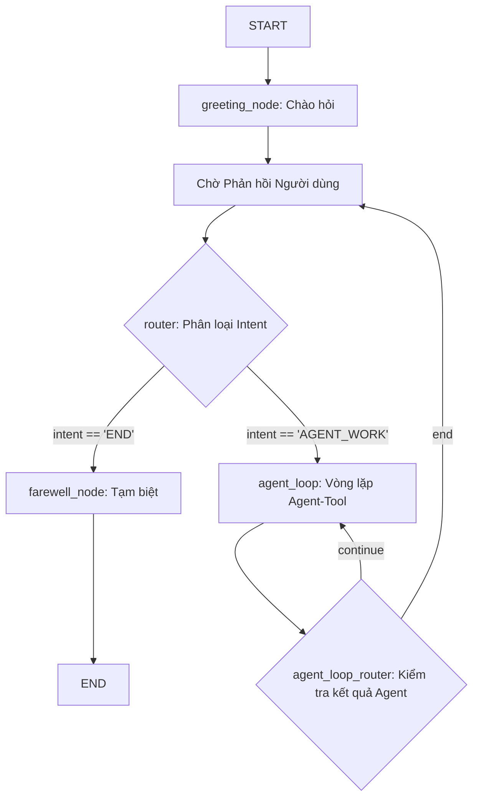

# Đặc tả Kỹ thuật: Chatbot SSTC với Kiến trúc Lai (Hybrid Graph & Agent-Tool)

## 1. Tổng quan

Tài liệu này mô tả đặc tả kỹ thuật để triển khai chatbot SSTC. Kiến trúc được sử dụng là một mô hình **lai (Hybrid)**, kết hợp giữa một đồ thị trạng thái có cấu trúc (Stateful Graph) để quản lý các giai đoạn của cuộc trò chuyện và một **Agent-Tool** mạnh mẽ để xử lý các nghiệp vụ cốt lõi. Mô hình này đảm bảo chatbot vừa có khả năng xử lý linh hoạt, vừa tuân thủ các quy tắc về trải nghiệm người dùng như chủ động chào hỏi và kết thúc một cách thân thiện.

Tất cả các mô hình ngôn ngữ (LLM) sẽ được cung cấp qua **Ollama**.

## 2. Kiến trúc Luồng (Graph Architecture)

Hệ thống được xây dựng dưới dạng một đồ thị trạng thái trong `LangGraph` với các node và cạnh điều kiện được định nghĩa rõ ràng.

-   **`greeting_node`**: Node bắt đầu, chủ động tạo và gửi lời chào.
-   **`router`**: Một node định tuyến đơn giản, quyết định xem người dùng muốn kết thúc hay cần xử lý nghiệp vụ.
-   **`agent_loop`**: Đây là một vòng lặp con chứa logic Agent-Tool mạnh mẽ để xử lý các yêu cầu phức tạp.
-   **`farewell_node`**: Node kết thúc, tạo và gửi lời chào tạm biệt.

## 3. Đặc tả Thành phần và Luồng xử lý

### a. Giai đoạn 1: Chào hỏi Chủ động

-   **Kích hoạt:** Ngay khi phiên trò chuyện bắt đầu.
-   **Node thực thi:** `greeting_node`.
-   **Logic:**
    1.  Gọi mô hình **`phi4-mini`** qua Ollama.
    2.  Sử dụng một prompt được thiết kế để tạo ra các câu chào đa dạng, sáng tạo, và chuyên nghiệp theo văn phong của SSTC.
    3.  Gửi câu chào đã tạo cho người dùng.
    4.  Cập nhật `State` với tin nhắn của assistant.
    5.  Chuyển sang trạng thái chờ phản hồi từ người dùng.

### b. Giai đoạn 2: Phân loại Intent Ban đầu

-   **Kích hoạt:** Sau khi người dùng gửi tin nhắn đầu tiên hoặc các tin nhắn tiếp theo sau khi một tác vụ đã hoàn thành.
-   **Node thực thi:** `router`.
-   **Logic:**
    1.  **Thu thập ngữ cảnh:** Lấy tin nhắn hiện tại của người dùng và **một tin nhắn ngay trước đó** từ `State`.
    2.  Gọi mô hình **`phi4-reasoning`** qua Ollama.
    3.  Sử dụng một prompt yêu cầu mô hình phân loại intent dựa trên ngữ cảnh đã thu thập. Các intent có thể là:
        -   `END`: Nếu người dùng có ý định kết thúc (ví dụ: "cảm ơn", "tạm biệt").
        -   `AGENT_WORK`: Đối với tất cả các trường hợp còn lại (hỏi về sản phẩm, bảo hành, trò chuyện thông thường).
    4.  Dựa trên kết quả, cạnh điều kiện sẽ chuyển luồng đến `farewell_node` hoặc `agent_loop`.

### c. Giai đoạn 3: Vòng lặp Agent-Tool (Xử lý Nghiệp vụ)

-   **Kích hoạt:** Khi `router` xác định intent là `AGENT_WORK`.
-   **Vòng lặp:** `agent_loop`.
-   **Logic Cốt lõi:**
    1.  **Agent Suy luận:**
        -   Node `agent` (bên trong vòng lặp) sẽ nhận toàn bộ lịch sử trò chuyện.
        -   Nó sẽ quyết định gọi một hoặc nhiều công cụ nếu cần thông tin để trả lời.
    2.  **Thực thi Công cụ:**
        -   Node `action` sẽ thực thi các công cụ được yêu cầu và trả kết quả về.
    3.  **Xử lý khi không rõ Intent (Yêu cầu số 2):**
        -   Nếu Agent phân tích yêu cầu của người dùng và thấy rằng **không có công cụ nào phù hợp** để gọi (ví dụ: người dùng chỉ đang trò chuyện phiếm), Agent sẽ **không gọi bất kỳ công cụ nào**.
        -   Thay vào đó, nó sẽ trực tiếp tạo ra một câu trả lời mang tính hội thoại, lịch sự.
        -   Prompt của Agent sẽ được thiết kế để trong những trường hợp này, câu trả lời sẽ khéo léo lái cuộc trò chuyện về các chủ đề được hỗ trợ. *Ví dụ: "Em hiểu ạ. Không biết hôm nay quý khách có đang quan tâm đến sản phẩm công nghệ nào hay cần hỗ trợ về dịch vụ của SSTC không ạ?"*
    4.  **Kết thúc Vòng lặp:** Vòng lặp sẽ tiếp tục cho đến khi Agent quyết định nó đã có đủ thông tin và tạo ra câu trả lời cuối cùng. Sau đó, luồng sẽ quay lại trạng thái chờ tin nhắn tiếp theo từ người dùng.

#### Danh sách Công cụ (Tools)

| Tên Công cụ | Mục đích | Dữ liệu đầu vào (Input) | Dữ liệu đầu ra (Output) |
| :--- | :--- | :--- | :--- |
| `tra_cuu_thong_tin_bao_hanh` | Tra cứu thông tin bảo hành cho một sản phẩm. | Một chuỗi (string) chứa số serial. | Một đối tượng (object/JSON) chứa thông tin chi tiết về bảo hành. |
| `tim_kiem_san_pham` | Tìm kiếm các sản phẩm dựa trên mô tả của người dùng. | Một chuỗi (string) chứa truy vấn tìm kiếm. | Một danh sách (list) các đối tượng sản phẩm, mỗi đối tượng chứa ID, tên, và giá. |
| `lay_chi_tiet_san_pham` | Lấy thông tin kỹ thuật và tồn kho của một sản phẩm. | Một chuỗi (string) chứa ID của sản phẩm. | Một đối tượng (object/JSON) chứa thông số kỹ thuật và số lượng tồn kho. |
| `kiem_tra_tinh_tuong_thich` | Kiểm tra xem hai linh kiện có tương thích với nhau không. | Hai chuỗi (string) chứa ID của hai sản phẩm. | Một đối tượng (object/JSON) chứa trạng thái tương thích (true/false) và giải thích. |
| `tim_kiem_trong_co_so_tri_thuc` | Tìm câu trả lời cho các câu hỏi chung trong tài liệu. | Một chuỗi (string) chứa câu hỏi của người dùng. | Một chuỗi (string) chứa đoạn văn bản có liên quan nhất được tìm thấy. |

### d. Giai đoạn 4: Kết thúc Cuộc trò chuyện

-   **Kích hoạt:** Khi `router` xác định intent là `END`.
-   **Node thực thi:** `farewell_node`.
-   **Logic:**
    1.  Gọi mô hình **`phi4-mini`** qua Ollama.
    2.  Sử dụng một prompt được thiết kế để tạo ra các câu chào tạm biệt sáng tạo, phù hợp với ngữ cảnh cuộc trò chuyện vừa kết thúc.
    3.  Gửi lời chào tạm biệt cho người dùng và kết thúc phiên.