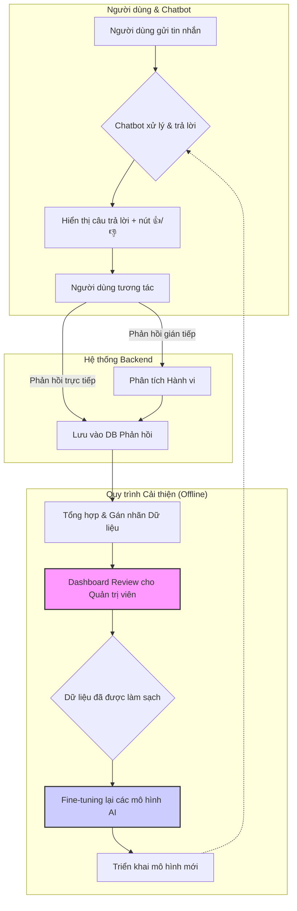

# Tính năng: Cơ chế Phản hồi và Tự cải thiện (Feedback Loop)

## 1. Tổng quan

Đây là một hệ thống được thiết kế để chatbot có thể "học hỏi" từ chính các tương tác của nó, giúp chất lượng hội thoại được cải thiện một cách liên tục và tự động theo thời gian. Mục tiêu là tạo ra một vòng lặp: **Tương tác -> Thu thập Phản hồi -> Phân tích -> Cải thiện Mô hình**, từ đó giảm thiểu công sức bảo trì thủ công và nâng cao sự hài lòng của người dùng.

## 2. Các hình thức thu thập phản hồi

### a. Phản hồi Trực tiếp (Explicit Feedback)

Đây là cách đơn giản và rõ ràng nhất để biết người dùng nghĩ gì về câu trả lời của chatbot.

-   **Cơ chế:** Sau mỗi câu trả lời của chatbot, hệ thống sẽ hiển thị hai biểu tượng đơn giản: 👍 (Hữu ích) và 👎 (Không hữu ích).
-   **Luồng xử lý khi người dùng bấm:**
    1.  Hành động của người dùng (bấm nút nào, cho câu trả lời nào, trong cuộc trò chuyện nào) được ghi lại vào một cơ sở dữ liệu riêng (ví dụ: bảng `FeedbackLog`).
    2.  Nếu người dùng bấm 👎, hệ thống có thể hiển thị một câu hỏi mở ngắn gọn (tùy chọn) để thu thập thêm chi tiết, ví dụ: "Cảm ơn bạn đã góp ý. Bạn có thể cho biết câu trả lời này chưa tốt ở điểm nào không ạ?"
-   **Dữ liệu thu thập:** `(conversation_id, message_id, feedback_type, user_comment)`

### b. Phản hồi Gián tiếp (Implicit Feedback)

Hành vi của người dùng trong cuộc trò chuyện cũng là một nguồn thông tin quý giá để đánh giá chất lượng câu trả lời.

-   **Cơ chế:** Hệ thống tự động phân tích các mẫu hành vi của người dùng để suy ra chất lượng của các tương tác.
-   **Các tín hiệu cần theo dõi:**
    -   **Hỏi lại câu hỏi (Rephrasing):** Nếu người dùng phải diễn đạt lại câu hỏi của mình ngay sau khi nhận được câu trả lời, đó là một dấu hiệu mạnh cho thấy câu trả lời trước đó không đáp ứng đúng nhu cầu.
    -   **Chuyển chủ đề đột ngột (Abandonment):** Nếu người dùng đang trong luồng tư vấn bán hàng mà đột ngột hỏi một câu không liên quan hoặc nói "thôi cảm ơn", có thể luồng tư vấn đó không hiệu quả.
    -   **Tự sửa lỗi (Self-correction):** Khi chatbot không thể trích xuất thông tin (ví dụ: số serial), và người dùng phải tự nhập lại theo một định dạng khác.
    -   **Yêu cầu kết nối người thật:** Nếu người dùng thường xuyên yêu cầu được nói chuyện với nhân viên hỗ trợ ở một node cụ thể, node đó có thể đang hoạt động không tốt.

## 3. Kiến trúc Vòng lặp Phản hồi

## 4. Luồng xử lý chi tiết

1.  **Thu thập:** Mọi phản hồi trực tiếp và tín hiệu gián tiếp được thu thập và lưu trữ trong cơ sở dữ liệu với đầy đủ ngữ cảnh (cuộc trò chuyện, câu hỏi, câu trả lời).

2.  **Tổng hợp & Phân tích:**
    -   Một tác vụ chạy định kỳ (ví dụ: hàng đêm) sẽ quét qua dữ liệu phản hồi.
    -   Hệ thống sẽ tự động gán nhãn cho các cặp `(câu hỏi, câu trả lời)` dựa trên phản hồi. Ví dụ: các cặp có phản hồi 👎 hoặc có tín hiệu "hỏi lại" sẽ được đánh dấu là "cần xem xét".

3.  **Review bởi Con người:**
    -   Một giao diện dashboard đơn giản được tạo ra cho người quản trị.
    -   Dashboard này sẽ hiển thị các cặp tương tác "cần xem xét".
    -   Người quản trị có thể:
        -   Viết lại câu trả lời cho đúng.
        -   Sửa lại việc phân loại intent nếu Router đã làm sai.
        -   Xác nhận đó là một trường hợp khó mà mô hình hiện tại chưa xử lý được.

4.  **Fine-tuning và Triển khai lại:**
    -   Dữ liệu đã được con người làm sạch và sửa lỗi sẽ tạo thành một "bộ dữ liệu vàng" (golden dataset).
    -   Bộ dữ liệu này được sử dụng để fine-tuning lại các mô hình ngôn ngữ (GPT-OSS, Phi-4) để chúng học được cách trả lời đúng cho các trường hợp tương tự trong tương lai.
    -   Sau khi fine-tuning và kiểm thử, mô hình mới sẽ được triển khai để thay thế mô hình cũ, hoàn thành vòng lặp.

## 5. Lợi ích

-   **Chất lượng tăng dần:** Hệ thống không ngừng tốt lên dựa trên dữ liệu thực tế.
-   **Giảm tải cho đội ngũ hỗ trợ:** Chatbot ngày càng xử lý được nhiều trường hợp khó hơn.
-   **Thích ứng nhanh:** Nhanh chóng phát hiện và khắc phục các vấn đề về kiến thức hoặc luồng xử lý khi có sản phẩm mới hoặc chính sách thay đổi.
