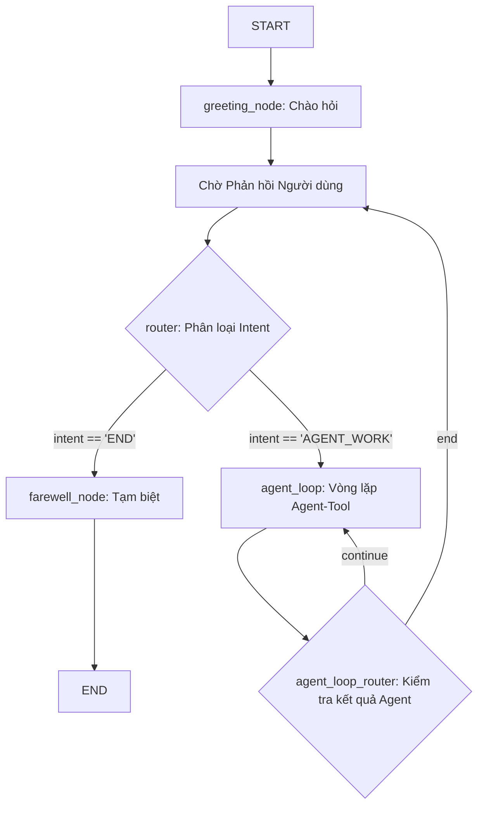

# Đặc tả Kỹ thuật: Chatbot SSTC với Kiến trúc Lai (Hybrid Graph & Agent-Tool)

## 1. Tổng quan

Tài liệu này mô tả đặc tả kỹ thuật để triển khai chatbot SSTC. Kiến trúc được sử dụng là một mô hình **lai (Hybrid)**, kết hợp giữa một đồ thị trạng thái có cấu trúc (Stateful Graph) để quản lý các giai đoạn của cuộc trò chuyện và một **Agent-Tool** mạnh mẽ để xử lý các nghiệp vụ cốt lõi. Mô hình này đảm bảo chatbot vừa có khả năng xử lý linh hoạt, vừa tuân thủ các quy tắc về trải nghiệm người dùng như chủ động chào hỏi và kết thúc một cách thân thiện.

Tất cả các mô hình ngôn ngữ (LLM) sẽ được cung cấp qua **Ollama**.

## 2. Quản lý phiên trò chuyện và lưu trữ lịch sử

-   Ngay khi khách hàng gửi tin nhắn đầu tiên, hệ thống sẽ tự động tạo một `conversation_id` mới (mã định danh phiên trò chuyện) **riêng biệt cho từng user**.
-   Mỗi user khi bắt đầu phiên trò chuyện sẽ được gán một `conversation_id` riêng, không trùng lặp với bất kỳ user nào khác.
-   Tất cả các tin nhắn (bao gồm cả từ user và assistant) sẽ được lưu trữ liên tục kèm theo `conversation_id` này.
-   Dữ liệu hội thoại (session, messages, metadata) được lưu trữ và truy xuất **hoàn toàn độc lập** theo `conversation_id` và `user_id`, đảm bảo không có sự lẫn lộn giữa các user, kể cả khi nhiều người giao tiếp đồng thời.
-   Điều này giúp bảo mật, cá nhân hóa và đảm bảo tính toàn vẹn dữ liệu cho từng khách hàng.

**Triển khai thực tế:**
-   Mỗi conversation được lưu trong bảng `conversations` với một `id` (UUID) duy nhất, gắn với `user_id` và metadata riêng.
-   Mỗi message được lưu trong bảng `messages`, luôn gắn với một `conversation_id`.
-   Các thao tác tạo, truy xuất, lưu trữ message/conversation đều dựa trên `conversation_id` và `user_id`, đảm bảo dữ liệu của từng user và từng phiên trò chuyện là hoàn toàn tách biệt, không thể lẫn lộn.

## 3. Kiến trúc Luồng (Graph Architecture)

Hệ thống được xây dựng dưới dạng một đồ thị trạng thái trong `LangGraph` với các node và cạnh điều kiện được định nghĩa rõ ràng.

-   **`greeting_node`**: Node bắt đầu, chủ động tạo và gửi lời chào.
-   **`router`**: Một node định tuyến đơn giản, quyết định xem người dùng muốn kết thúc hay cần xử lý nghiệp vụ.
-   **`agent_loop`**: Đây là một vòng lặp con chứa logic Agent-Tool mạnh mẽ để xử lý các yêu cầu phức tạp.
-   **`farewell_node`**: Node kết thúc, tạo và gửi lời chào tạm biệt.

## 4.2. Quản lý và sử dụng toàn bộ context hội thoại

-   **Mục tiêu:** Đảm bảo agent luôn nắm bắt, duy trì và tận dụng toàn bộ context (lịch sử hội thoại, thông tin khách hàng, trạng thái tác vụ, ngôn ngữ, v.v.) để giữ cuộc trò chuyện chu đáo, liền mạch và cá nhân hóa.
-   **Nguyên tắc:**
    1.  Agent luôn truy xuất và cập nhật toàn bộ lịch sử hội thoại, trạng thái session, thông tin khách hàng, trạng thái ngôn ngữ, các tác vụ đang xử lý.
    2.  Khi trả lời, agent phải cân nhắc toàn bộ context này để đảm bảo trả lời nhất quán, không bỏ sót thông tin, không hỏi lại những gì khách đã cung cấp.
    3.  Nếu khách đổi chủ đề, agent vẫn giữ được mạch hội thoại, có thể quay lại chủ đề cũ khi cần.
    4.  Agent chủ động nhắc lại các thông tin quan trọng (sản phẩm, vấn đề, ưu đãi, trạng thái bảo hành, v.v.) khi phù hợp để thể hiện sự quan tâm và chuyên nghiệp.
    5.  Nếu context quá dài, agent có thể tóm tắt lại các thông tin chính để truyền vào prompt LLM, đảm bảo hiệu quả và tiết kiệm token.
-   **Gợi ý kỹ thuật:**
    - Lưu context vào state/session (bao gồm lịch sử message, metadata, trạng thái ngôn ngữ, thông tin khách hàng, các tác vụ đang xử lý).
    - Khi tạo prompt cho LLM, truyền toàn bộ hoặc tóm tắt context vào để LLM trả lời sát thực tế.
    - Có thể sử dụng các kỹ thuật tóm tắt hội thoại (conversation summarization) nếu lịch sử quá dài.

-   **Tính năng:** Hệ thống tự động nhận diện ngôn ngữ của người dùng (tiếng Việt, tiếng Anh, v.v.) dựa trên nội dung tin nhắn đầu vào, và phản hồi bằng đúng ngôn ngữ đó.
-   **Chuyển đổi động:** Nếu trong quá trình trao đổi, người dùng yêu cầu đổi ngôn ngữ (ví dụ: "nói tiếng Anh đi", "speak English please", "nói tiếng Việt đi"), hệ thống sẽ chuyển sang ngôn ngữ được yêu cầu cho toàn bộ các phản hồi tiếp theo.
-   **Cách triển khai:**
    1.  **Nhận diện ngôn ngữ:** Sử dụng mô hình LLM hoặc thư viện nhận diện ngôn ngữ (langdetect, fasttext, v.v.) để xác định ngôn ngữ của từng tin nhắn user gửi lên.
    2.  **Lưu trạng thái ngôn ngữ:** Mỗi session/conversation lưu trạng thái ngôn ngữ hiện tại (ví dụ: "vi", "en").
    3.  **Cập nhật trạng thái:** Nếu phát hiện user yêu cầu đổi ngôn ngữ (qua intent hoặc từ khóa), cập nhật trạng thái ngôn ngữ cho session.
    4.  **Sinh phản hồi:** Khi tạo prompt cho LLM, luôn truyền kèm ngôn ngữ mục tiêu để LLM trả lời đúng ngôn ngữ.
    5.  **Ví dụ logic:**
        - User nhắn: "Can you help me?" → Nhận diện tiếng Anh → Trả lời bằng tiếng Anh.
        - User nhắn: "Nói tiếng Anh đi" → Cập nhật trạng thái ngôn ngữ sang "en" → Các câu trả lời sau đều bằng tiếng Anh.
        - User nhắn: "Nói tiếng Việt đi" → Cập nhật trạng thái ngôn ngữ sang "vi" → Các câu trả lời sau đều bằng tiếng Việt.
    6.  **Gợi ý prompt cho LLM:**
        - "Hãy trả lời bằng [ngôn ngữ] đúng với yêu cầu của khách hàng. Nếu khách yêu cầu đổi ngôn ngữ, hãy chuyển đổi ngay từ câu trả lời tiếp theo."

---
## 4. Đặc tả Thành phần và Luồng xử lý

### a. Giai đoạn 1: Chào hỏi Chủ động

-   **Kích hoạt:** Ngay khi phiên trò chuyện bắt đầu.
-   **Node thực thi:** `greeting_node`.
-   **Logic:**
    1.  Gọi mô hình sinh câu chào qua Ollama, sử dụng biến môi trường `${SMALL_GENERATE_MODEL}` (ví dụ: `phi4-mini`).
    2.  Sử dụng một prompt được thiết kế để tạo ra các câu chào đa dạng, sáng tạo, và chuyên nghiệp theo văn phong của SSTC.
    3.  Gửi câu chào đã tạo cho người dùng.
    4.  Cập nhật `State` với tin nhắn của assistant.
    5.  Chuyển sang trạng thái chờ phản hồi từ người dùng.

### b. Giai đoạn 2: Phân loại Intent Ban đầu

-   **Kích hoạt:** Sau khi người dùng gửi tin nhắn đầu tiên hoặc các tin nhắn tiếp theo sau khi một tác vụ đã hoàn thành.
-   **Node thực thi:** `router`.
-   **Logic:**
    1.  **Thu thập ngữ cảnh:** Lấy tin nhắn hiện tại của người dùng và **một tin nhắn ngay trước đó** từ `State`.
    2.  Gọi mô hình phân loại intent qua Ollama, sử dụng biến môi trường `${SMALL_REASONING_MODEL}` (ví dụ: `phi4-mini-reasoning`).
    3.  Sử dụng một prompt yêu cầu mô hình phân loại intent dựa trên ngữ cảnh đã thu thập. Các intent có thể là:
        -   `END`: Nếu người dùng có ý định kết thúc (ví dụ: "cảm ơn", "tạm biệt").
        -   `AGENT_WORK`: Đối với tất cả các trường hợp còn lại (hỏi về sản phẩm, bảo hành, trò chuyện thông thường).
    4.  Dựa trên kết quả, cạnh điều kiện sẽ chuyển luồng đến `farewell_node` hoặc `agent_loop`.

### c. Giai đoạn 3: Vòng lặp Agent-Tool (Xử lý Nghiệp vụ)

-   **Kích hoạt:** Khi `router` xác định intent là `AGENT_WORK`.
-   **Vòng lặp:** `agent_loop`.
-   **Logic Cốt lõi:**
    1.  **Agent Suy luận:**
        -   Node `agent` (bên trong vòng lặp) sẽ nhận toàn bộ lịch sử trò chuyện.
        -   Khi cần sinh câu trả lời tổng hợp, agent sẽ gọi mô hình sinh qua Ollama, sử dụng biến môi trường `${GENERATE_MODEL}` (ví dụ: `gpt-oss`).
        -   Khi cần suy luận logic hoặc phân tích sâu, agent sẽ gọi mô hình reasoning qua Ollama, sử dụng biến môi trường `${REASONING_MODEL}` (ví dụ: `gpt-oss`).
        -   Nó sẽ quyết định gọi một hoặc nhiều công cụ nếu cần thông tin để trả lời.
    2.  **Thực thi Công cụ:**
        -   Node `action` sẽ thực thi các công cụ được yêu cầu và trả kết quả về.
    3.  **Xử lý Trò chuyện Phiếm và Dẫn dắt Nâng cao:**
        -   Khi Agent xác định người dùng đang trò chuyện phiếm (không có công cụ nào phù hợp để gọi), Agent sẽ không gọi công cụ mà trực tiếp tạo ra một câu trả lời hội thoại.
        -   Agent sẽ thực hiện các bước sau:
            1. **Phân tích cảm xúc (Sentiment Analysis):** Xác định sắc thái cảm xúc trong câu nói của người dùng (tích cực, tiêu cực, trung tính) để đưa ra phản hồi đồng cảm, phù hợp.
            2. **Ghi nhớ ngữ cảnh (Contextual Memory):** Sử dụng thông tin từ các cuộc trò chuyện trước đó (nếu có) để cá nhân hóa lời dẫn dắt, ví dụ nhắc lại sản phẩm hoặc chủ đề mà khách từng quan tâm.
            3. **Đa dạng hóa chiến lược dẫn dắt:** Agent sẽ chọn một trong nhiều kỹ thuật dẫn dắt để tránh lặp lại:
                - Hỏi trực tiếp về thiết bị, nhu cầu, vấn đề liên quan.
                - Chia sẻ một mẹo nhỏ hoặc thông tin hữu ích liên quan đến công nghệ.
                - Đưa ra nhận định chung và câu hỏi mở về trải nghiệm công nghệ.
        -   **Quy tắc:**
            - Luôn phản hồi trực tiếp, thể hiện sự đồng cảm hoặc bình luận về câu nói của khách trước khi dẫn dắt.
            - Dẫn dắt phải tự nhiên, không gượng ép, ưu tiên liên hệ đến hai chủ đề chính: tư vấn mua hàng hoặc kiểm tra bảo hành.
        -   **Ví dụ minh họa:**
            *User: "Hôm nay trời đẹp quá"*
            > "Đúng rồi ạ! Thời tiết đẹp thế này làm việc cũng hiệu quả hơn đúng không quý khách? Em tò mò quý khách đang làm việc trên laptop hay PC vậy ạ? Có khi nào gặp khó khăn gì về thiết bị không ạ?"

            *User: "Mình đang stress vì deadline"*
            > "Em hiểu cảm giác đó ạ! Deadline nhiều khi thật sức ép. Hy vọng máy tính của quý khách ít nhất cũng chạy mượt mà để hỗ trợ công việc tốt nhất. Quý khách có gặp tình trạng máy chậm hay gì không ạ?"

            *User: "Chán quá, công việc dạo này nhiều vấn đề."*
            > "Em rất hiểu cảm giác của quý khách ạ. Đôi khi công việc có những lúc thật áp lực. Mong rằng ít nhất thì chiếc máy tính của quý khách vẫn đang hoạt động tốt để không làm mình thêm phiền lòng. Quý khách có cần em kiểm tra giúp gì về thiết bị không ạ?"

            *User: "Hôm trước mình hỏi về mainboard B760M ấy nhỉ"*
            > "Dạ đúng rồi ạ! Em vẫn nhớ quý khách từng quan tâm đến mainboard B760M. Không biết quý khách đã quyết định chọn mẫu đó chưa hay cần em tư vấn thêm gì không ạ?"

            *User: "Deadline nhiều quá, máy cứ lag mãi"*
            > "Deadline nhiều mà máy lại lag thì thật là khó chịu ạ. Em có một mẹo nhỏ giúp tối ưu tốc độ máy tính khi làm việc nặng, quý khách có muốn nghe không ạ? Hoặc nếu cần, em có thể tư vấn các dòng SSD mới giúp tăng tốc máy rất hiệu quả."
    4.  **Kết thúc Vòng lặp:** Vòng lặp sẽ tiếp tục cho đến khi Agent quyết định nó đã có đủ thông tin và tạo ra câu trả lời cuối cùng. Sau đó, luồng sẽ quay lại trạng thái chờ tin nhắn tiếp theo từ người dùng.

### d. Giai đoạn 4: Kết thúc Cuộc trò chuyện

-   **Kích hoạt:** Khi `router` xác định intent là `END`.
-   **Node thực thi:** `farewell_node`.
-   **Logic:**
    1.  Gọi mô hình sinh câu tạm biệt qua Ollama, sử dụng biến môi trường `${SMALL_GENERATE_MODEL}` (ví dụ: `phi4-mini`).
    2.  Sử dụng một prompt được thiết kế để tạo ra các câu chào tạm biệt sáng tạo, phù hợp với ngữ cảnh cuộc trò chuyện vừa kết thúc.
    3.  Gửi lời chào tạm biệt cho người dùng và kết thúc phiên.

## 5. Hệ thống Agent-Tool và Quản lý Tri thức

### a. Danh sách Công cụ (Tools)

| Tên Công cụ | Mục đích | Dữ liệu đầu vào (Input) | Dữ liệu đầu ra (Output) |
| :--- | :--- | :--- | :--- |
| `tra_cuu_thong_tin_bao_hanh` | Tra cứu thông tin bảo hành cho một sản phẩm. | Một chuỗi (string) chứa số serial. | Một đối tượng (object/JSON) chứa thông tin chi tiết về bảo hành. |
| `tim_kiem_san_pham` | Tìm kiếm các sản phẩm dựa trên mô tả của người dùng. | Một chuỗi (string) chứa truy vấn tìm kiếm. | Một danh sách (list) các đối tượng sản phẩm, mỗi đối tượng chứa ID, tên, và giá. |
| `lay_chi_tiet_san_pham` | Lấy thông tin kỹ thuật và tồn kho của một sản phẩm. | Một chuỗi (string) chứa ID của sản phẩm. | Một đối tượng (object/JSON) chứa thông số kỹ thuật và số lượng tồn kho. |
| `kiem_tra_tinh_tuong_thich` | Kiểm tra xem hai linh kiện có tương thích với nhau không. | Hai chuỗi (string) chứa ID của hai sản phẩm. | Một đối tượng (object/JSON) chứa trạng thái tương thích (true/false) và giải thích. |
| `tim_kiem_trong_co_so_tri_thuc` | Tìm câu trả lời cho các câu hỏi chung trong tài liệu. | Một chuỗi (string) chứa câu hỏi của người dùng. | Một chuỗi (string) chứa đoạn văn bản có liên quan nhất được tìm thấy. |

### b. Quản lý tri thức và RAG (Retrieval-Augmented Generation)

#### Phân loại dữ liệu:
-   **Knowledge base (dạng tài liệu, dùng cho RAG):**
    -   Chính sách bảo hành (nhiều trường hợp, quy tắc, ngoại lệ, quy trình)
    -   Giới thiệu về công ty, thương hiệu, quy trình dịch vụ
    -   UPS (Unique Selling Points) của sản phẩm: điểm mạnh, lợi ích, FAQ, so sánh
    -   (Có thể bổ sung: quy trình đổi trả, hướng dẫn gửi bảo hành, các hướng dẫn sử dụng)
-   **Database (dữ liệu có cấu trúc, truy vấn trực tiếp):**
    -   Danh sách sản phẩm, thông số kỹ thuật, tồn kho, giá
    -   Thông tin bảo hành từng serial, lịch sử bảo hành, trạng thái từng sản phẩm
    -   (Có thể bổ sung: mapping sản phẩm với chính sách đặc biệt nếu có)

#### Cách AI sử dụng RAG:
-   Khi user hỏi về chính sách, quy trình, điểm mạnh sản phẩm, AI sẽ truy xuất (retrieve) các đoạn văn bản liên quan từ knowledge base đã được index (RAG).
-   Khi user hỏi về thông tin sản phẩm cụ thể, tồn kho, bảo hành serial, AI sẽ truy vấn trực tiếp vào database.
-   Agent sẽ tự động kết hợp thông tin từ cả hai nguồn để tạo ra câu trả lời đầy đủ, chính xác và có thể trích dẫn nguồn nếu cần.

#### Ví dụ luồng xử lý RAG:
1.  **User:** "Chính sách bảo hành của SSTC cho SSD là gì?"
2.  **Agent:**
    -   Nhận diện đây là câu hỏi về chính sách → gọi công cụ RAG để truy xuất đoạn văn bản liên quan trong knowledge base.
    -   Tổng hợp, diễn giải lại bằng ngôn ngữ tự nhiên, có thể trích dẫn hoặc tóm tắt.
    -   Nếu cần, hỏi thêm user về sản phẩm cụ thể để truy vấn database lấy thông tin chi tiết.

3.  **User:** "SSD MAX-IV 1TB còn hàng không?"
4.  **Agent:**
    -   Nhận diện đây là câu hỏi về tồn kho sản phẩm → truy vấn trực tiếp database.
    -   Nếu user hỏi thêm về điểm mạnh sản phẩm, Agent sẽ kết hợp truy xuất RAG (UPS) và database (specs, tồn kho).

### c. Quản lý và tích hợp chương trình Marketing/Khuyến mãi

-   **Knowledge base (RAG):**
    -   Lưu trữ các tài liệu mô tả tổng quan về các chương trình marketing, ưu đãi, sự kiện, thể lệ tham gia, câu hỏi thường gặp về khuyến mãi, các case study thành công, hướng dẫn sử dụng mã giảm giá, v.v.
    -   Dùng để AI có thể giải thích chi tiết, trả lời các câu hỏi về quy định, điều kiện, cách thức nhận ưu đãi, hoặc các thông tin tổng quan về các chiến dịch marketing.

-   **Database (dữ liệu có cấu trúc):**
    -   Lưu các chương trình khuyến mãi đang diễn ra, mã giảm giá, điều kiện áp dụng, thời gian hiệu lực, sản phẩm áp dụng, số lượng còn lại, lịch sử sử dụng mã của từng user (nếu có cá nhân hóa).
    -   Dùng để AI kiểm tra, xác nhận cho user về các ưu đãi hiện hành, tư vấn mã giảm giá phù hợp, hoặc thông báo các chương trình sắp hết hạn/còn lại ít suất.

-   **Cách AI sử dụng:**
    -   Khi user hỏi về chương trình khuyến mãi, AI sẽ truy xuất thông tin tổng quan từ knowledge base (RAG) để giải thích quy định, thể lệ, hướng dẫn sử dụng.
    -   Nếu user hỏi về ưu đãi cụ thể, mã giảm giá, hoặc muốn kiểm tra quyền lợi cá nhân, AI sẽ truy vấn trực tiếp database để trả lời chính xác về điều kiện, trạng thái, hoặc gợi ý mã phù hợp.
    -   AI có thể chủ động đề xuất ưu đãi khi nhận thấy user có nhu cầu mua hàng, hoặc nhắc nhở về các chương trình sắp kết thúc.

#### Ví dụ luồng xử lý Marketing:
1.  **User:** "Có chương trình khuyến mãi nào cho SSD không?"
2.  **Agent:**
    -   Truy vấn database để kiểm tra các ưu đãi hiện hành cho sản phẩm SSD.
    -   Nếu có, trả lời chi tiết về mức giảm giá, điều kiện, thời gian áp dụng.
    -   Nếu user hỏi thêm về thể lệ, AI sẽ truy xuất RAG để giải thích quy định, hướng dẫn sử dụng mã.

3.  **User:** "Mã giảm giá này dùng thế nào?"
4.  **Agent:**
    -   Truy xuất knowledge base để giải thích cách sử dụng mã, điều kiện áp dụng, các lưu ý quan trọng.

#### Đề xuất bổ sung:
-   Nếu có các chiến dịch marketing cá nhân hóa (ví dụ: ưu đãi sinh nhật, ưu đãi cho khách hàng thân thiết), nên lưu lịch sử sử dụng mã và trạng thái ưu đãi của từng user trong database để AI có thể tư vấn sát thực tế nhất.
