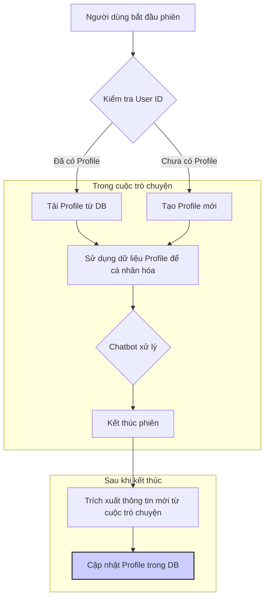

# Tính năng: Xây dựng Hồ sơ Người dùng (Customer Profile)

## 1. Tổng quan

Tính năng này cho phép hệ thống chatbot xây dựng và duy trì một hồ sơ cá nhân hóa cho mỗi người dùng qua các phiên trò chuyện khác nhau. Thay vì xem mỗi cuộc trò chuyện là một sự kiện độc lập, chatbot có thể "nhớ" lại các tương tác trong quá khứ để cung cấp một trải nghiệm liền mạch, thông minh và phù hợp hơn với từng cá nhân.

Việc triển khai tính năng này cần đặt ưu tiên hàng đầu cho **quyền riêng tư và sự đồng ý của người dùng**.

## 2. Lợi ích

-   **Cá nhân hóa Trải nghiệm:**
    -   Chatbot có thể chào hỏi người dùng bằng tên và nhắc lại các mối quan tâm trước đây.
    -   *Ví dụ:* "Chào anh Minh, lần trước anh có hỏi về mainboard B760M. Hôm nay anh có cần em tư vấn thêm về sản phẩm này không ạ?"
-   **Tư vấn Chủ động và Phù hợp:**
    -   Hệ thống có thể đề xuất sản phẩm dựa trên lịch sử mua hàng hoặc các sản phẩm người dùng đã xem.
    -   *Ví dụ:* Nếu người dùng đã mua một CPU hiệu năng cao, chatbot có thể gợi ý các loại RAM hoặc SSD tương xứng.
-   **Rút ngắn Thời gian Hỗ trợ:**
    -   Người dùng không cần phải lặp lại thông tin cá nhân hoặc các vấn đề đã trình bày trước đó.
    -   Chatbot có thể tự động truy xuất thông tin bảo hành cho các sản phẩm người dùng đã đăng ký.
-   **Tăng cường Mối quan hệ Khách hàng:** Một trải nghiệm được cá nhân hóa cho thấy sự quan tâm của thương hiệu đối với từng khách hàng, giúp xây dựng lòng trung thành.

## 3. Kiến trúc và Luồng dữ liệu

### a. Mô hình Dữ liệu

Cần một bảng `CustomerProfile` trong cơ sở dữ liệu SQL để lưu trữ thông tin.

```sql
CREATE TABLE CustomerProfile (
    user_id VARCHAR(255) PRIMARY KEY, -- ID định danh người dùng (ví dụ: từ cookie, tài khoản đăng nhập)
    display_name VARCHAR(255),
    created_at TIMESTAMP DEFAULT CURRENT_TIMESTAMP,
    last_seen_at TIMESTAMP,

    -- Dữ liệu được suy ra từ các cuộc trò chuyện
    inferred_preferences TEXT, -- Lưu dưới dạng JSON, ví dụ: {"budget": "high", "use_case": "gaming"}
    viewed_products TEXT,      -- JSON array các product_id
    interest_topics TEXT,      -- JSON array các intent, ví dụ: ["sales", "warranty"]

    -- Dữ liệu giao dịch (nếu có tích hợp)
    purchased_products TEXT,   -- JSON array các product_id
    registered_serials TEXT,   -- JSON array các số serial đã đăng ký bảo hành

    -- Quyền riêng tư
    consent_given BOOLEAN DEFAULT FALSE, -- Người dùng đã đồng ý cho lưu trữ thông tin chưa
    consent_timestamp TIMESTAMP
);
```

### b. Luồng xử lý



1.  **Khởi tạo phiên:** Khi người dùng bắt đầu, hệ thống xác định `user_id`. Nếu đã tồn tại, tải hồ sơ tương ứng.
2.  **Cá nhân hóa tương tác:** Dữ liệu từ hồ sơ được đưa vào `State` của LangGraph.
    -   **Node Chào hỏi:** Sử dụng `display_name` để chào hỏi.
    -   **Node Router:** Có thể sử dụng `interest_topics` để hỗ trợ phân loại intent.
    -   **Sub-graph Bán hàng:** Sử dụng `inferred_preferences` và `viewed_products` để đưa ra gợi ý chính xác hơn.
    -   **Sub-graph Bảo hành:** Tự động truy cập `registered_serials` để người dùng không cần nhập lại.
3.  **Cập nhật hồ sơ:** Sau khi phiên kết thúc, một tác vụ bất đồng bộ sẽ được kích hoạt.
    -   Tác vụ này sử dụng một mô hình LLM (ví dụ: Phi-4 Reasoning) để đọc qua toàn bộ cuộc trò chuyện.
    -   Nó sẽ trích xuất các thông tin quan trọng: sản phẩm nào đã được thảo luận, nhu cầu của người dùng là gì (ví dụ: "cần máy cho đồ họa"), ngân sách ước tính, v.v.
    -   Các thông tin này được tổng hợp và cập nhật vào các trường JSON trong bảng `CustomerProfile`.

## 4. Quyền riêng tư và Sự đồng ý

Đây là phần quan trọng nhất của tính năng.

-   **Thu thập sự đồng ý (Consent):**
    -   Trong lần tương tác đầu tiên, chatbot phải hỏi một cách rõ ràng: *"Để mang lại trải nghiệm tốt hơn trong những lần tới, SSTC có thể ghi nhớ nội dung cuộc trò chuyện này không ạ? Chúng tôi cam kết bảo mật thông tin của bạn."*
    -   Chỉ khi người dùng đồng ý (`consent_given = TRUE`), hệ thống mới bắt đầu lưu trữ và cập nhật hồ sơ.
-   **Quyền của Người dùng:**
    -   Cần cung cấp cho người dùng một cơ chế để xem, sửa đổi, hoặc xóa hồ sơ của họ. Điều này có thể được thực hiện thông qua một trang quản lý tài khoản hoặc yêu cầu trực tiếp với chatbot.
-   **Ẩn thông tin nhạy cảm (PII Anonymization):**
    -   Trước khi lưu bất kỳ nội dung trò chuyện nào vào log hoặc hồ sơ, hệ thống phải tự động phát hiện và che giấu các thông tin nhận dạng cá nhân như số điện thoại, email, địa chỉ nhà.
    -   *Ví dụ:* "số điện thoại của tôi là 0912345678" sẽ được lưu thành "số điện thoại của tôi là [PHONE_NUMBER]".
